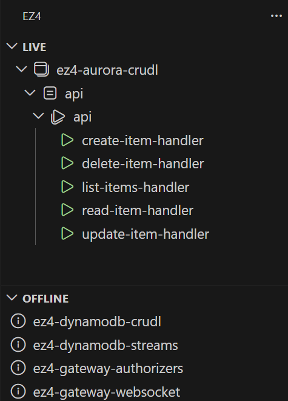
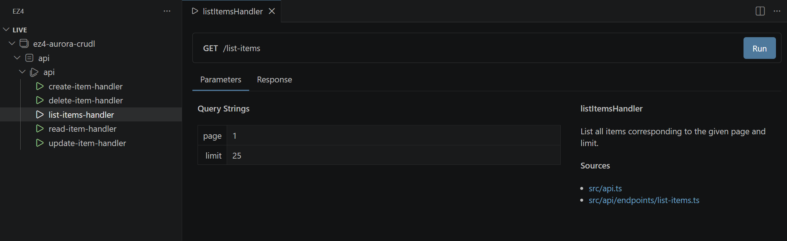
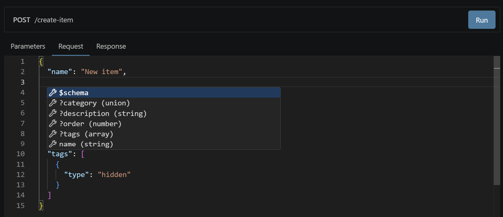
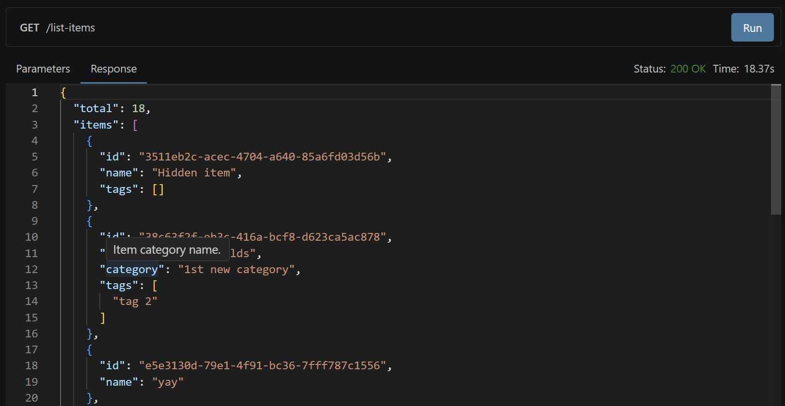

# EZ4 VS Code

The [EZ4](https://github.com/sbalmt/ez4) extension brings dynamic visualization, intelligent payload editing, and documentation‑aware tooling directly into VS Code. It enhances your development workflow with component exploration, JSON IntelliSense, interactive parameter editing, and rich response inspection.

## Features

### Component Explorer

Navigate your application's components with clarity.
**EZ4** builds a dynamic tree of your structure so you can jump instantly to the parts you need.

### Interactive Parameters

Fill in and adjust parameters effortlessly while testing your application.
Designed for rapid iteration and smooth development cycles.

### Request Editor

Write JSON payloads with real **IntelliSense**, type‑aware suggestions, and inline documentation.
No more guessing property names or searching for schemas.

### Response Viewer

Inspect JSON responses enhanced with documentation pulled directly from your typings.
Understand every property at a glance, perfect for debugging and API development.

## License

MIT License
